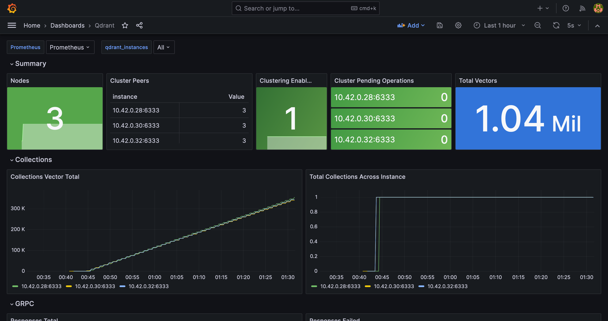

<div align="center" id="top">
    <h2>Alioth</h2>
    <h3>Ingest data at scale into a Qdrant DB Cluster</h3>
</div>

## Contents
- [Introduction](#introduction)
- [Architecture](#architecture)
  - [Overview](#overview)
  - [Ingestion Pipeline](#ingestion-pipeline)
  - [Backup & Restore Mechanism](#backup--restore-mechanism)
- [Prerequisites](#prerequisites)
  - [For Development](#for-development)
  - [For Deployment](#for-deployment)
- [Development](#development)
- [Deploy](#deploy)
  - [Kubernetes](#kubernetes)
  - [Docker-Compose (Not Recommended) ](#docker-compose-not-recommended)
- [Load Test](#load-test)
   - [Setup and Configuration](#setup-and-configuration)
- [Observability](#observability)
  - [Dashboards](#dashboards)
  - [Alerts](#alerts)
- [API Usage](#api-usage)
- [Further Improvements & Ideas](#further-improvements--ideas)
- [Authors](#authors)
- [License](#license)

## Introduction
1. Alioth is a Python application that uses Celery with RabbitMQ as a broker and backend to ingest data at a very high rate into a distributed Qdrant Vector DB Cluster hosted primarily on Kubernetes.
2. It is designed with a goal to make it as easy as possible to be scaled horizontally.
3. It supports automatic snapshotting and backup for collections as well as Qdrant host storage to any S3 Compliant Object Storage such as AWS S3, Minio, etc.
4. There is an easy-to-use recovery mechanism that can restore a collection on a Qdrant host from the snapshots that are stored in S3 Compliant Object storage.
5. Observability and performance monitoring is configured using Grafana, Prometheus, Alert-manager, and various exporters (ref: [Observability](#observability))

<p align="right">(<a href="#top">back to top</a>)</p>

## Architecture

- ### Overview
  1. Alioth doesn't reimplement all the API endpoints available in Qdrant, it only implements endpoints that require resources and can be scaled horizontally.
     > To make it easier to use the Upstream Qdrant API use this Postman collection that implements the commonly used APIs. Do remember to set the appropriate variables by clicking on the Collection and going to Variables [](https://app.getpostman.com/run-collection/19694638-331c2888-b878-40e5-8bfa-0db7cc5887da?action=collection%2Ffork&source=rip_markdown&collection-url=entityId%3D19694638-331c2888-b878-40e5-8bfa-0db7cc5887da%26entityType%3Dcollection%26workspaceId%3Ddb115311-bd17-4c17-8706-8b8073f9afbb#?env%5BDevelopment%5D=W3sia2V5IjoicHJvdG9jb2wiLCJ2YWx1ZSI6Imh0dHAiLCJlbmFibGVkIjp0cnVlLCJ0eXBlIjoiZGVmYXVsdCIsInNlc3Npb25WYWx1ZSI6Imh0dHAiLCJzZXNzaW9uSW5kZXgiOjB9LHsia2V5IjoicWRyYW50X2hvc3QiLCJ2YWx1ZSI6ImxvY2FsaG9zdCIsImVuYWJsZWQiOnRydWUsInR5cGUiOiJkZWZhdWx0Iiwic2Vzc2lvblZhbHVlIjoibG9jYWxob3N0Iiwic2Vzc2lvbkluZGV4IjoxfSx7ImtleSI6InFkcmFudF9wb3J0IiwidmFsdWUiOiI2MzMzIiwiZW5hYmxlZCI6dHJ1ZSwidHlwZSI6ImRlZmF1bHQiLCJzZXNzaW9uVmFsdWUiOiI2MzMzIiwic2Vzc2lvbkluZGV4IjoyfSx7ImtleSI6InFkcmFudF9ncnBjX3BvcnQiLCJ2YWx1ZSI6IjYzMzQiLCJlbmFibGVkIjp0cnVlLCJ0eXBlIjoiZGVmYXVsdCIsInNlc3Npb25WYWx1ZSI6IjYzMzQiLCJzZXNzaW9uSW5kZXgiOjN9LHsia2V5IjoiYWxpb3RoX2hvc3QiLCJ2YWx1ZSI6ImxvY2FsaG9zdCIsImVuYWJsZWQiOnRydWUsInR5cGUiOiJkZWZhdWx0Iiwic2Vzc2lvblZhbHVlIjoibG9jYWxob3N0Iiwic2Vzc2lvbkluZGV4Ijo0fSx7ImtleSI6ImFsaW90aF9wb3J0IiwidmFsdWUiOiIxMzM3IiwiZW5hYmxlZCI6dHJ1ZSwidHlwZSI6ImRlZmF1bHQiLCJzZXNzaW9uVmFsdWUiOiIxMzM3Iiwic2Vzc2lvbkluZGV4Ijo1fSx7ImtleSI6ImNvbGxlY3Rpb25fbmFtZSIsInZhbHVlIjoibW92aWVfY29sbGVjdGlvbiIsImVuYWJsZWQiOnRydWUsInR5cGUiOiJkZWZhdWx0Iiwic2Vzc2lvblZhbHVlIjoibW92aWVfY29sbGVjdGlvbiIsInNlc3Npb25JbmRleCI6Nn1d)
  2. It is designed with scalability in mind and thus the API server and the Celery workers are stateless.
  3. The API server is the primary gateway for resource-heavy workloads and is written with [FastAPI](https://fastapi.tiangolo.com/) and served using [Gunicorn](https://gunicorn.org/).
  4. The FastAPI endpoints accept requests and responses both of which use predefined [pydantic](https://docs.pydantic.dev/latest/) models for the type of requests and responses. All the endpoints that implement Qdrant APIs simply invoke celery tasks based on the workload the endpoint implements.
  5. Celery is an open-source asynchronous task queue or job queue which is based on distributed message passing. It basically has a bunch of workers that consume and process messages from a  queue (RabbitMQ queue in the case of Alioth) and based on the settings stores the result.
  6. The tasks in Celery are any function that is run by the workers, these workers can be scaled horizontally as well as vertically. As everything is async in celery, it needs a broker to coordinate everything. Celery supports multiple brokers but Alitoh uses RabbitMQ due to its ease of use and it is cost-efficient to run at scale. Redis was considered but as it primarily uses memory to store data it would've been expensive to run at scale and data ingestion doesn't need real-time speed of processing.
  7. Kafka was also considered but Celery doesn't officially support it and most importantly running self-hosted Kafka on Kubernetes or bare-metal is a huge operational effort and using the cloud would've been expensive.
  8. The API Docs are available at `/docs` from the Alioth Endpoint.

<p align="right">(<a href="#top">back to top</a>)</p>

- ### Ingestion Pipeline
  1. The user has to create a collection manually by using Qdrant API or Client libraries. The reason to NOT include a collection endpoint in Alioth is simply that it would just act as a proxy and increase latency for no performance gain. Collections are highly configurable and have lots of parameters that the user has to be aware of and abstracting them away is not the way to go. 
     > Do remember to disable indexing for the collection from the API if you are going to ingest large amounts of data.
  2. The ingestion endpoint (`/alioth/ingest`) accepts Post Request and invokes `app.tasks.ingestion.ingest` celery task.
  3. Once a message or payload is `POST`ed to the API, the payload is first added to the `ingest` queue, and then the invoked tasks are spawned by the ingestion celery worker that consumes the `ingest` queue and takes care of processing the payload and upserting it in Qdrant DB.
  4. Alioth uses the `.upsert` function of the Qdrant Client and uses batches to upsert data into Qdrant DB as it can handle single as well as multiple records.  
  5. The ingestion celery worker can be horizontally scaled based on the rate of ingestion of records. 

<p align="right">(<a href="#top">back to top</a>)</p>

- ### Backup & Restore mechanism
   1. You need to configure the following config files and environment variables before using the Backup and Recovery mechanism implemented in Alioth **IF** you are setting it up manually.
      > You don't need to configure these config files and environment variables if you are using the supported deployments method as both of them use sane defaults and should work OOTB.
      1. Create two files `collections.json` & `hosts.json` and mount in appropriately in Alioth API and Celery Workers. Example format for these files can be found at `config/`
      2. Set the Environment Variables `QDRANT_DB_HOSTS_JSON_PATH` and `QDRANT_DB_COLLECTIONS_JSON_PATH` to point to the path where the `collections.json` and `hosts.json` are mounted
      3. Set the Environment Variable `BACKUP_SCHEDULE` to a number that represents the period in seconds of the Backup cron job.
         

  - #### Backup
    1. Alioth supports both collection and full storage snapshots.
    2. A Celery beat worker periodically invokes backup tasks for collection (`app.tasks.backup.backup_collection`) and storage (`app.tasks.backup.backup_storage`) that is processed by the backup celery worker and the queue consumed by the worker is `backup`
    2. These snapshots created periodically (based on `BACKUP_SCHEDULE` env var) are uploaded to **Minio** using `boto3`, So any S3-compliant object storage will work as storage backend.
    3. The snapshots can also be manually invoked if and when required from the Alioth REST API endpoints (`/alioth/backup/collection` for collection snapshots and `/alioth/backup/storage/` for storage snapshots). The documentation for the endpoints can be found at `/docs`
  - #### Restore
    1. Qdrant officially only supports collection restoration from the REST API in Cluster Mode (ref: https://qdrant.tech/documentation/concepts/snapshots/#restore-snapshot)
    2. As Alioth is primarily meant to be highly scalable it supports only recovery from collection and does **not** support Full Storage recovery although snapshots are created for each Qdrant Replica in case it is needed in a worst-case scenario.
    3. Full Storage recovery in distributed mode requires individual access to nodes and clusters have to be set up manually. The Qdrant DB instance has to be started with a CLI flag that points to the snapshot. This requires too much manual intervention and is not possible with Kubernetes as Qdrant is primarily deployed in a distributed mode. It would be required to write a Kubernetes Operator that does the legwork.
       > Do note for standalone single node Qdrant DB Instance it is possible to recover from snapshots using the CLI flag (--snapshot) that Qdrant supports.
    4. The restoration process is manually invoked if and when required from the Alioth REST API endpoints(`/alioth/restore/collection`). This invokes a (`app.tasks.restore.restore_collection`) celery tasks that are processed and run by the restore celery worker and the queue consumed by the worker is `restore`

<p align="right">(<a href="#top">back to top</a>)</p>

## Prerequisites

-  ### For development
   1. Install pyenv for Python version management. (ref: https://github.com/pyenv/pyenv?tab=readme-ov-file#installation)
   2. Install poetry for Python dependency management. (ref: https://python-poetry.org/docs/#installation)
   3. Install and configure docker w/ docker-compose (ref: https://docs.docker.com/engine/install/)
   4. Make sure `make` is properly installed and verify using  `make --help`
   5. Clone Alioth using `git clone git@github.com:CoolFool/alioth.git` (SSH) or `git clone https://github.com/CoolFool/alioth.git` (HTTPS)
  
-  ### For deployment
    1. Install K3d for a Kubernetes Cluster (ref: https://k3d.io/v5.6.0/#install-current-latest-release)
    2. Install Helm for deploying to Kubernetes (ref: https://helm.sh/docs/intro/install/#through-package-managers)
    3. Install kubectl to access Kubernetes Cluster (https://kubernetes.io/docs/tasks/tools/#kubectl)
    4. Install OpenLens for accessing Kubernetes through a GUI (ref: https://github.com/MuhammedKalkan/OpenLens?tab=readme-ov-file#installation)
 

<p align="right">(<a href="#top">back to top</a>)</p>

## Development
  - Assuming the prerequisites are properly satisfied and you are in the root Project directory, run the following commands to get the Development environment up and running
     1. Set up pyenv and poetry: `make deps`
     2. Get the upstream services up and running: `make dev-services`
     3. (Optional) Create a `.env` file for the environment variables that you want to override. All the supported environment variables (OR) settings can be found in `app/settings.py`
     4. To start the various services locally w/o docker run:
          1. `make run-alioth` - Run Alioth API with gunicorn
          2. `make spawn-ingestion-celery-worker` - Spawn celery ingestion worker
          3. `make spawn-restore-celery-worker` - Spawn celery restoration worker
          4. `make spawn-backup-celery-worker` - Spawn celery backup worker
          5. `make spawn-celery-beat-worker` - Spawn celery beat worker
     5. To build a docker image use:
          1. Setup buildx instance for cross-platform images: `make setup-buildx`
          2. Build docker image: `make build` (Optional: You can set the environment variables `AUTHOR` `APPLICATION` `VERSION` at runtime to change the image repo and version)
     6. (Optional) To create a k3d cluster for testing w/ Kubernetes: `make k3d-cluster`   
     7. (Optional) To deploy Alioth on a k3d cluster with local image: `make deploy-alioth-with-local-image`
     8. (Optional) To get the service endpoints for accessing the Alioth deployed on K8s: `make welcome_k8s`
     9. (Optional) To restart Alioth services on kubernetes: `make k3d-restart-deployments`
     10. (Optional) To delete Kubernetes environment including the cluster: `make clean`

<p align="right">(<a href="#top">back to top</a>)</p>

## Deploy

- ### Kubernetes
    - Kubernetes is the recommended way to deploy Alioth as it abstracts away and takes care of many issues involved in building a high-scalable system that can ingest data at a very fast rate. 
    - To make changes to the config that is going to be deployed you can edit the `configmap.yaml` and `secret.yaml` located at `deploy/templates` and do a `make deploy-alioth-with-upstream-image` from root directory assuming Kubernetes Cluster is already setup.
    - Although **Alioth** can be deployed on any Kubernetes cluster for demo purposes we are going to use K3d locally.

    1. #### Create Kubernetes cluster using K3d
       ```bash 
          make k3d-cluster
       ```
    2. #### Deploy using Helm
       ```bash
          make deploy-alioth-with-upstream-image
        ```
    3. #### Get the service endpoints for accessing from local
       ```bash
          make welcome_k8s
        ```
    4. #### (Optional) Restart Alioth if required
       ```bash
          make k3d-restart-deployments
       ```
      
- ### Docker-compose (Not recommended)
   A barebones version of **Alioth** without any observability or multiple application replicas can be deployed using docker-compose although it's not recommended.
   - Deploy using docker-compose
      ```bash
          docker compose up
       ```
     Alioth will be available at http://localhost:1337

<p align="right">(<a href="#top">back to top</a>)</p>

## Load Test

  1. Load testing is setup and configured using [locust](https://locust.io/)
  2. For load testing a collection (`movie_collection`) with a vector size of `100` and `6` shards is created using the official Qdrant client
  3. A payload (or) record is randomly generated from a movie dataset and a batch of `100` (default) is ingested at a time. The batch size can be configured by setting the environment variable `ALIOTH_LOAD_TEST_BATCH_SIZE` at runtime
  4. The vectors as previously stated are of size `100` and they are randomly generated at runtime.
- ### Setup and Configuration
  1. Get the IP of the Qdrant Host (or) Service as well as the REST API Port for Kubernetes as well as docker-compose-based deployments and set them as environment variables `QDRANT_DB_HOST` and `QDRANT_DB_PORT` respectively.
     
     1. **Docker-compose:** 
         1. The default Docker-compose config maps the ports to host and the `QDRANT_DB_PORT` is `6333` and `QDRANT_DB_HOST` is `localhost`
        
     2. **Kubernetes** 
         1. Get all the service endpoints: `make welcome_k8s`
         2. Note down the value of `Qdrant REST Endpoint` and get the host(w/o http://) (`QDRANT_DB_HOST`) and port (`QDRANT_DB_PORT`)

    Set the environment variables using `export QDRANT_DB_HOST=<host>` & `export QDRANT_DB_PORT=<port>`
  
  2. (Optional) Set the `ALIOTH_LOAD_TEST_BATCH_SIZE` environment variable using `export ALIOTH_LOAD_TEST_BATCH_SIZE=n`  if required
  3. (Optional) If you haven't setup the development environment as documented above, run `make deps` first to install the dependencies required by locust.
  4. Run the command: 
        ```bash 
           make load-test-alioth
        ```
  5. Visit the locust dashboard at http://0.0.0.0:8089
  6. On the Locust Dashboard Set the **Number of users** to `50`, **Spawn rate** to `5` and set the **Host** to `Alioth Endpoint` that is available from `make welcome_k8s`
  7. To scale up the replicas in Kubernetes of either the Alioth API or the Celery workers use the following commands based on the deployment you want to scale:
     ```bash
        kubectl scale deploy alioth --replicas=2
        kubectl scale deploy alioth-ingest --replicas=2
        kubectl scale deploy alioth-backup --replicas=2
        kubectl scale deploy alioth-restore --replicas=2
     ```
     You can of course change the number of replicas to however many you want.

<p align="right">(<a href="#top">back to top</a>)</p>

## Observability
  Observability is set up using Prometheus & Grafana. Following are the services that are deployed on Kubernetes for Observability purposes:
  
  1. **Prometheus** - A time-series database for storing metrics
  2. **Grafana** - An open-source application for creating beautiful visualizations
  3. **AlertManager** - Handles alerts sent by client applications such as the Prometheus server.
  4. **Kube-state-metrics** - A service that listens to the Kubernetes API server and generates metrics about the state of the objects (pods, deployments, ingress, etc etc)
  5. **Prometheus-node-exporter** - Exposes a wide variety of hardware- and kernel-related metrics
  6. **Prometheus-statsd-exporter** - It is a drop-in replacement for StatsD. This exporter translates StatsD metrics to Prometheus metrics via configured mapping rules (Used for gnuicorn monitoring, as it is officially instrumented to work only with statsd, ref: https://docs.gunicorn.org/en/stable/instrumentation.html)
  7. **Celery-exporter** - Exposes metrics for celery

Other than these services that are explicitly deployed for observability, various applications like RabbtitMQ, Qdrant, and Kubernetes themselves expose their metrics that are scraped by Prometheus.

  As the monitoring stack is deployed on Kubernetes, Prometheus uses service discovery for finding all the metrics endpoints and scraping them. Configuring custom scraping rules is not required.

  > Due to time constraint reasons only a custom-made Qdrant Dashboard is pre-loaded in Grafana and 2 alerts are created for alert-manager. More dashboards and alerts are on the way :))
- ### Dashboards
  - Qdrant Dashboard:
      | Qdrant Dashboard (Summary)  |
      |---|
      |   |
      | **Qdrant Dashboard (GRPC)**  |
      |   |

<p align="right">(<a href="#top">back to top</a>)</p>

- ### Alerts
  1. InstanceDown:
     ```yaml
       - alert: InstanceDown
          expr: up == 0
          for: 5m
          labels:
            priority: P1
          annotations:
            description: '{{ $labels.instance }} of job {{ $labels.job }} has been down for more than 5 minutes.'
            summary: 'Instance {{ $labels.instance }} down'
     ```
  2. QdrantNodeDown:
     ```yaml
      - alert: QdrantNodeDown
        expr: app_info{app="qdrant"} < 1
        for: 0m
        labels:
          priority: P1
        annotations:
          description: '{{ $labels.instance }} Qdrant node has been down for more than 30 seconds'
          summary: 'Qdrant instance ({{ $labels.instance }}) is down'
     ```
  3. RabbitmqNodeDown:
     ```yaml
      - alert: RabbitmqNodeDown
        expr: sum(rabbitmq_build_info) < 3
        for: 0m
        labels:
          priority: P1
        annotations:
          summary: Rabbitmq node down (instance {{ $labels.instance }})
          description: "Less than 3 nodes running in RabbitMQ cluster\n  VALUE = {{ $value }}\n  LABELS = {{ $labels }}"
     ```
  4. GunicornWorkersDown:
      ```yaml
        - alert: GunicornWorkersDown
          expr: sum(gunicorn_workers) < 4
          for: 0m
          labels:
            priority: P1
          annotations:
            summary: Gunicorn worker down (instance {{ $labels.instance }})
            description: "Gunicorn has less than 4 workers\n  VALUE = {{ $value }}\n  LABELS = {{ $labels }}"
      ```

<p align="right">(<a href="#top">back to top</a>)</p>

## API Usage
1. GET `/` -> Root
2. GET `/alioth/` -> Home
3. POST `/alioth/ingest` -> Ingest Handler
   ```json
    {
      "collection_name": "string",
      "batch": {
        "ids": [
          0,
          "string"
        ],
        "vectors": [
          [
            0
          ]
        ],
        "payloads": [
          {}
        ]
      }
    }
   ```
3. POST `/alioth/backup/collection` -> Collection Snapshot Handler (`string` is the collection name)
   ```json
    {
      "collections": [
        "string"
      ]
    }
   ```
4. POST `/alioth/backup/storage` -> Storage Snapshot Handler
   ```json
    {
    "hosts": [
      {
        "grpc_port": "6334",
        "host": "localhost",
        "port": "6333",
        "prefer_grpc": "true"
      }]
    }
   
   ```
5. POST `/alioth/restore/collection` -> Restore Collection Handler (`snapshot_url` is optional)
   ```json
    {
      "collection_name": "string",
      "host": {
        "grpc_port": "6334",
        "host": "localhost",
        "port": "6333",
        "prefer_grpc": "true"
      },
      "snapshot_url": "string"
    }
   ```

<p align="right">(<a href="#top">back to top</a>)</p>

## Further Improvements & Ideas:
- Improve health checks for all internal services.
- Implement Kubernetes Event-driven Autoscaling (KEDA) for scaling celery workers and Alioth API based on metrics such as Ready Messages in RabbitMQ, Database load experienced by Qdrant or the rate of data ingestion by Alioth API, etc.(ref: https://keda.sh/)
- Periodic clearing of snapshots to save costs on resources
- Right-size Alioth API and workers by observing their resource usage to run a cost-efficient service at scale
- Write end-to-end tests
- Setup flower for celery-specific monitoring (ref: https://flower.readthedocs.io/en/latest/)
- Improve helm chart documentation (ref: https://github.com/norwoodj/helm-docs)
- Add dashboards for Gunicorn, Celery, RabbitMQ

<p align="right">(<a href="#top">back to top</a>)</p>

## Authors

- [@coolfool](https://www.github.com/coolfool)

<p align="right">(<a href="#top">back to top</a>)</p>

## License

[MIT](https://choosealicense.com/licenses/mit/)
